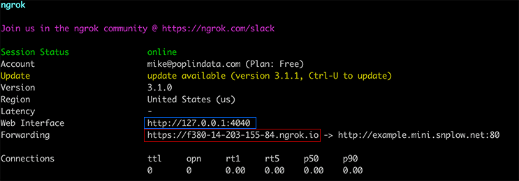

= Snowplow Inspector Web Extension
:Author: Snowplow Australia

A debugging tool to help you examine and debug your link:https://snowplow.io[Snowplow] tracking implementation.

.Features
- List and filter all your tracking events
- See tracking parameters in human-friendly format
- GET and POST tracking support
- Automatically decode and parse link:https://snowplow.io/blog/introducing-self-describing-jsons/[Self-Describing Events and Custom Entities]
- Validate your Entities and Events against the schemas in your link:https://github.com/snowplow/iglu[Iglu Repository]
- Import events from your bad rows bucket/stream and see why they failed enrichment

Feedback, feature requests, pull requests, and bug reports are welcome! Please link:https://github.com/poplindata/chrome-snowplow-inspector/issues[file an issue].

== Install
At the moment, only Chrome/Chromium are supported via an official app store, and builds for Firefox are available, but not supported.
The extension also works in link:https://www.microsoft.com/en-us/edge[Microsoft Edge], but is not yet in the extension store.
To install the extension, visit the page on the link:https://chrome.google.com/webstore/detail/maplkdomeamdlngconidoefjpogkmljm[Chrome Web Store].
You can get builds for Firefox v60+ in link:https://github.com/poplindata/chrome-snowplow-inspector/releases[Releases].

=== Schema Validation
The Schema Manager inside the extension should let you load in local JSON Schema files during development, and you can also add your production or Snowplow Mini Iglu Repositories to test against what you have in production.

All of

- Local Registries (embedded into the extension)
- link:https://docs.snowplow.io/docs/pipeline-components-and-applications/iglu/iglu-repositories/static-repo/[Static Iglu Repositories]
- link:https://docs.snowplow.io/docs/pipeline-components-and-applications/iglu/iglu-repositories/iglu-server/[Iglu Servers] (like the one used in link:https://github.com/snowplow/snowplow-mini[Snowplow Mini])
- link:https://docs.snowplow.io/docs/understanding-tracking-design/managing-data-structures-via-the-api-2/[Data Structures API]
are supported.

==== Adding an Iglu Repository
. Head to the extension pane in the Dev Tools, and hit the `Manage Schemas` button in the top toolbar
. In the bottom right, hit `Registries...`, then `Add`
. Fill out the details for you new Registry and save
. Note your browser will request permission for the Extension to access the registries' Domain, this may happen in the main browser window rather than the Dev Tools window if it's not docked
. You can also import your pipeline's configuration using Import and supplying a link:https://docs.snowplow.io/docs/pipeline-components-and-applications/iglu/iglu-resolver/[resolver-config]

By default we include the URL for link:https://github.com/snowplow/iglu-central[Iglu Central], which includes schemas for the built-in tracking JSONs. You can add as many repositories as you like.


==== Importing from Ngrok Tunnels

The Ngrok Tunnel import uses an link:https://ngrok.com/[Ngrok] tunnel in order to process events from remote devices.
Ngrok provides a HTTP endpoint that we can use as the temporary collector endpoint.

By using this tunnel this allows you to test and debug events from additional devices and platforms including:

- A separate mobile device (using a native or React Native app)
- Server side events (e.g., server side Go codebase)
- IoT devices (smart watch, TVs)
- Any other device or implementation where you can override the Collector Endpoint

To start the tunnel ensure you have downloaded `ngrok` locally and create a new tunnel on the device you are running Chrome and the extension on, with:

[code,shell-session]
```
$ ngrok http example.snplow.net
```

Where `example.snplow.net` is the Collector hostname that you wish to forward requests on to.
This can be link:https://docs.snowplow.io/docs/managing-data-quality/testing-and-qa-workflows/set-up-automated-testing-with-snowplow-micro/[Micro], link:https://docs.snowplow.io/docs/pipeline-components-and-applications/snowplow-mini/[Mini] or any other Snowplow Collector / server that responds with a 200.

Once your tunnel has started ngrok will return a HTTP/S url (under 'Forwarding') that you should then use as your Collector host.
Events sent to this host will be intercepted by ngrok and forwarded to your Snowplow destination without modification.



In addition ngrok will create a Web Interface that runs on `localhost` (port `4040`) by default.
The API for this interface is used to retrieve events and insert them into the tool.
If you wish to override or change this address you can do so in the options settings of the Chrome extension by right-clicking on the icon and opening Options.

If you wish to use a static address to forward to you can do so on one of the paid ngrok plans (a few dollars a month) to avoid having the hostname being dynamic.

To start visualizing these events open the debugger and select 'Import' then 'Ngrok Tunnel' which will begin to poll (via the link:https://ngrok.com/docs/ngrok-agent/api[Ngrok Agent API]) for events.

To stop streaming these events select 'Import' then 'Stop Ngrok Tunnel'.

== Develop
=== Build
Run `npm install` to install required dependencies, then `npm run build` to build the extension in the `dist/` directory.

Instructions to install a local development version of the extension to test are over at the link:https://developer.chrome.com/extensions/getstarted#unpacked[extension development documentation].

=== Hack
You can also use `npm start` to start parcel in watch mode and symlink the resources to make editing easier; source changes should then be reflected immediately in `dist/`.
Some changes will automatically be reflected straight away, more intense changes will need to reload the extension in your browser to update correctly.
